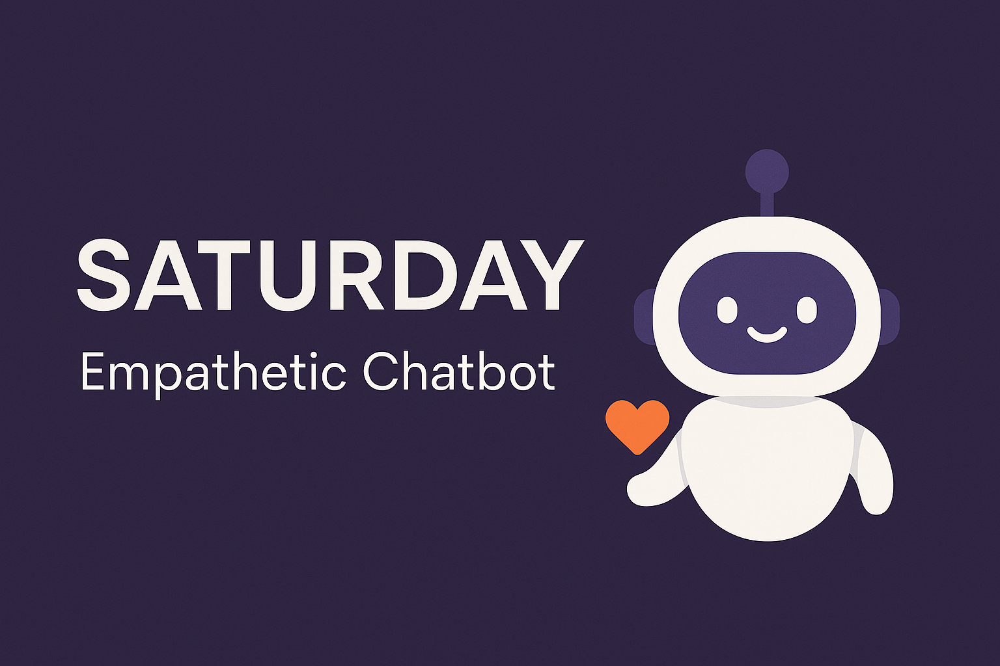

# SATURDAY
A EMPHATHATIC CHATBOT




<h1 align="center">🤖 Emotion-Aware Empathetic Chatbot</h1>

<p align="center">
  Smart Sentiment Detection + Human-Like Conversations 🚀
</p>

<p align="center">
  
</p>

<p align="center">
  
  
  
  
  
  
</p>


# 🤖 Emotion-Aware Empathetic Chatbot

## 📚 Overview
An intelligent chatbot that detects user emotions using NLP techniques (fine-tuned BERT model) and replies empathetically in a natural, human-like way.

## 🏗️ Project Structure
<TERM-PROJECT/
│
├── BACKEND/
│   ├── backend.py                 # Flask server to handle chat and emotion detection
│   ├── evalscript.py               # Script to evaluate model accuracy and F1 score
│   ├── train_emotion_model.py      # Script to train/fine-tune the BERT model
│   ├── emotion_data_preprocessing.py  # Script to preprocess GoEmotions dataset
│   ├── trained_emotion_model/      # Directory containing the fine-tuned model
│   │    ├── config.json
│   │    ├── model.safetensors
│   │    ├── special_tokens_map.json
│   │    ├── tokenizer.json
│   │    ├── tokenizer_config.json
│   │    ├── vocab.txt
│
├── FRONTEND/
│   ├── index.html                  # Chatbot frontend
│   ├── style.css                   # Styling for chatbot UI
│
├── DATASETS/
│   ├── goemotions_only.csv         # Preprocessed GoEmotions dataset
│
├── README.md                       # Project overview and setup guide
│
└── requirements.txt (Optional)     # If you want to add all your pip installs here
>

## 🏗️ Project Architecture
<User --> Frontend --> Flask Backend
                           |
                     Uses trained BERT model
                           |
                Predicts emotion accurately
                           |
             Replies empathetically + asks questions
>


## 🚀 How to Run the Project
1. Clone the repo.
2. Install dependencies:
    ```bash
    pip install -r requirements.txt
    ```
2. Preprocess the data :
    ```bash
    python emotion_data_preprocessing.py
    ```
2. train the model:
    ```bash
    python train_emotion_model.py
    ```
3. Start the backend:
    ```bash
    cd BACKEND
    python backend.py
    ```
4. Open `FRONTEND/index.html` in your browser.

## 🛠️ Technologies Used
- Python (Flask)
- HuggingFace Transformers (BERT)
- Torch (PyTorch)
- HTML/CSS/JS (Frontend)

## 📈 Features
- Real-time emotion detection
- Contextual, empathetic responses
- Natural human-like conversation flow
- User-centered interaction design (HCI)

## 🤝 Credits
- Fine-tuned using the GoEmotions dataset by Google Research.
- Frontend inspired by modern chatbot designs.

## 📄 License
This project is open-source and free to use.
