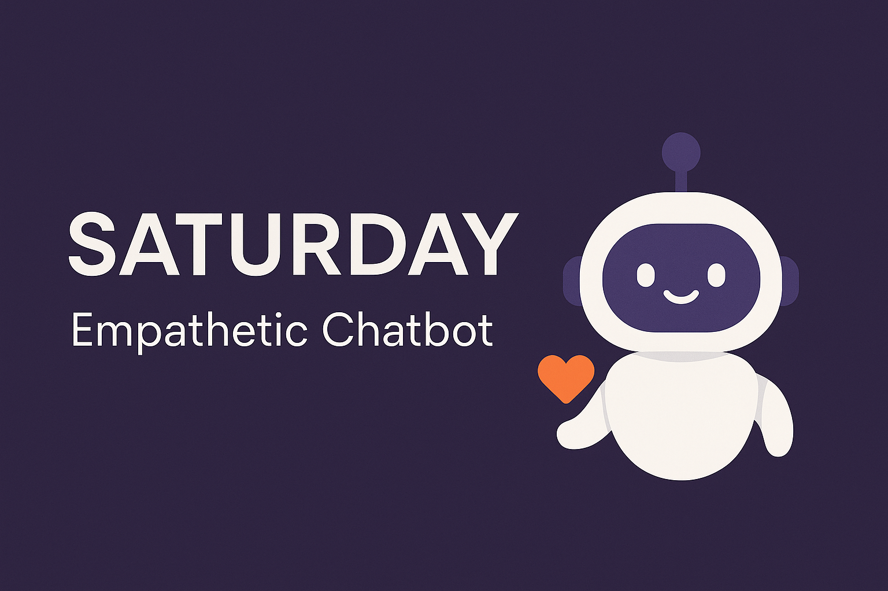

<h1 align="center">SATURDAY 🤖</h1>

<p align="center">
  <b>S</b>entiment-<b>A</b>ware <b>T</b>extual <b>U</b>nderstanding <b>a</b>nd <b>R</b>esponse <b>D</b>ialogue <b>A</b>ssistant
</p>

<p align="center">
  An affordable, emotion-aware companion for people who struggle to pay for therapy -
  a calmer place to talk things through, for the price of a coffee, not a co-pay.
</p>

<p align="center">
  <a href="https://saturday-bbww.onrender.com"><b>🌐 Live demo</b></a>
</p>

<p align="center">
  
  
  
  
  
</p>



> ⚠️ **Not a doctor.** SATURDAY is a supportive first step. It is **not** a therapist, medical
> service, or emergency line, and it does not diagnose or treat conditions. In a crisis, call or
> text **988** (US Suicide and Crisis Lifeline) or your local emergency number.

---

## ✨ What it is

SATURDAY is a warm, human-feeling chat companion wrapped in an immersive 3D web experience. It
listens, understands the emotion behind what you say, mirrors your tone (casual, formal, or Gen-Z),
and responds with empathy, while gently pointing people toward real help when it matters.

- **3D-styled landing page** with a hero, "how it works", pricing, and a mental-health safety
  section, over a live Three.js background.
- **Human-like conversations** generated by an LLM (Google **Gemini**, free tier), so replies
  actually understand context and match the person's voice instead of picking from a script.
- **Accounts** with sign in / guest mode, and sessions persisted per user.
- **Zero-cost by design.** Gemini's free tier needs no credit card, so it can never run up a bill. If
  no key is set (or the free tier is rate-limited), it falls back to built-in supportive replies.

## 🏗️ Architecture

```
User -> React app (3D landing -> login -> chat)
                      |  POST /chat, /api/*
                      v
             Flask backend (serves the React build)
                      |
        +-------------+--------------+
   Gemini free tier            SQLite auth (users.db)
   (BACKEND/llm.py)            (BACKEND/database_auth.py)
```

- **Frontend:** React 18, styled-components, framer-motion, Three.js (`src/`).
- **Backend:** Flask (`BACKEND/backend.py`) serves the built React app and exposes `/chat` plus the
  `/api/*` auth endpoints.
- **Conversations:** `BACKEND/llm.py` calls Gemini and owns the system prompt (tone-mirroring and
  crisis-safety). Swappable for another provider (for example Claude) in one file.
- **Emotion badge:** a lightweight keyword detector labels each message. An optional fine-tuned BERT
  model can be dropped into `BACKEND/trained_emotion_model/` for higher accuracy (not shipped).

## 🚀 Run it locally

```bash
# 1. Backend deps (light - no torch needed for the app)
pip install -r requirements.txt

# 2. (Optional) enable human-like replies. Get a FREE key, no card:
#    https://aistudio.google.com/apikey
export GEMINI_API_KEY=your_free_key   # without this, it uses template replies

# 3. Build the frontend and let Flask serve it
npm install
npm run build

# 4. Start the server (serves the app and API on http://localhost:10000)
python -m BACKEND.backend
```

For frontend-only development with hot reload: `npm start` (talks to the backend on port 10000).

## ☁️ Deploy (Render)

The app deploys as a **single service** via the `Dockerfile`. It builds the React app and Flask
serves it. On [Render](https://render.com): **New -> Web Service -> this repo**, language **Docker**.

Set one environment variable to turn on Gemini replies:

| Variable | Value |
|---|---|
| `GEMINI_API_KEY` | your free key from [Google AI Studio](https://aistudio.google.com/apikey) |
| `GEMINI_MODEL` *(optional)* | defaults to `gemini-2.0-flash` |

A free-tier key has no card attached, so the deployment can never be billed. Worst case is a rate
limit, and the app falls back to its built-in replies.

## 🧠 Optional: train the emotion model

The emotion badge works out of the box with keyword detection. To train the higher-accuracy BERT
model on the GoEmotions dataset:

```bash
pip install torch transformers pandas scikit-learn datasets
python BACKEND/emotion_data_preprocessing.py
python BACKEND/train_emotion_model.py   # saves BACKEND/trained_emotion_model/
```

## 🛠️ Tech

React, styled-components, framer-motion, Three.js, Flask, Google Gemini, SQLite, Docker, Render.

## 👤 Author

**Nitin Sampath Rohan Bheemavarapu**

## 📄 License

MIT. Open-source and free to use.
